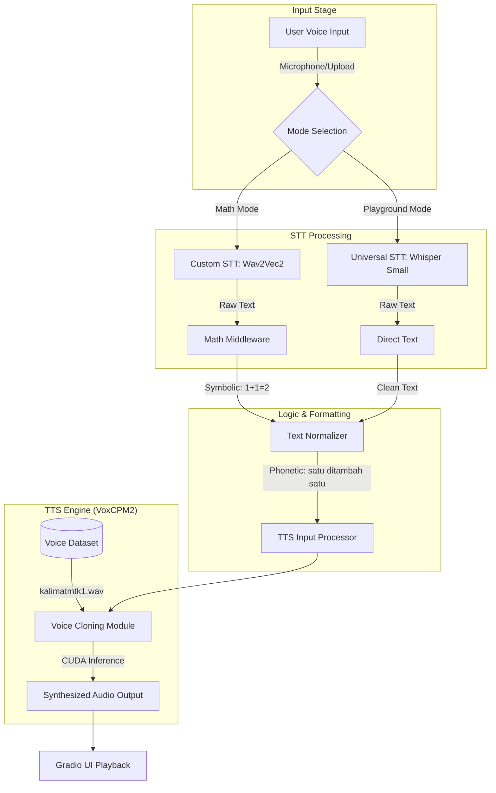
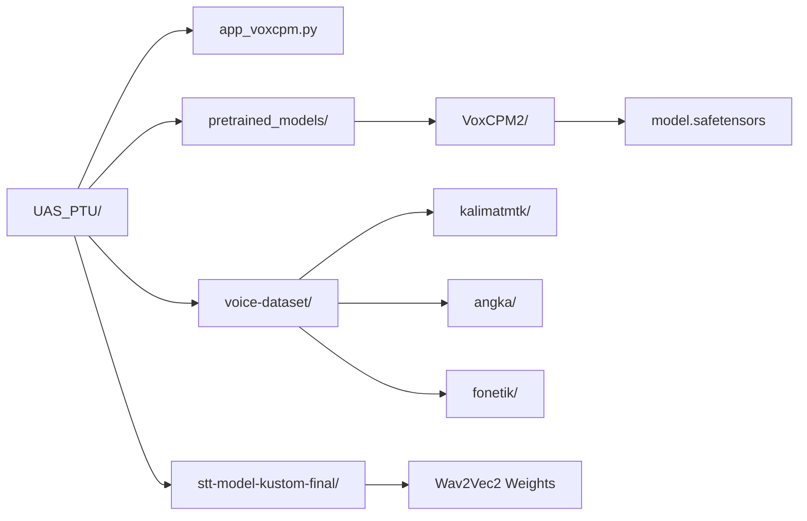
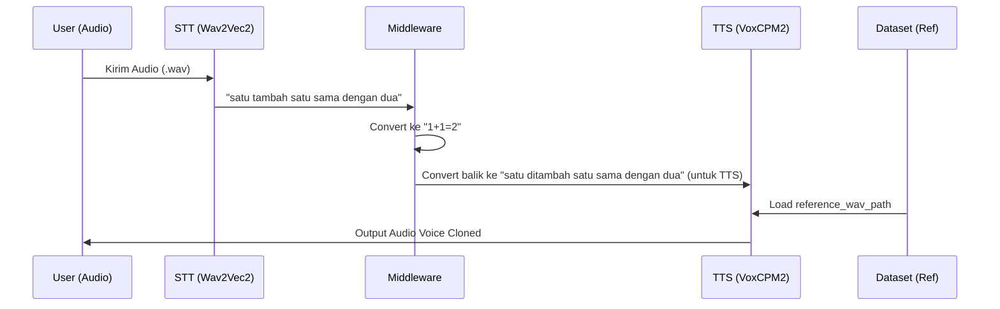

# 📊 UAS PTU Project Graph

Berikut adalah visualisasi alur sistem Integrated STT-TTS dengan VoxCPM2.

## 1. System Architecture Pipeline

## 2. Directory Structure & Dependencies

## 3. Data Flow Detail (Math Mode)

