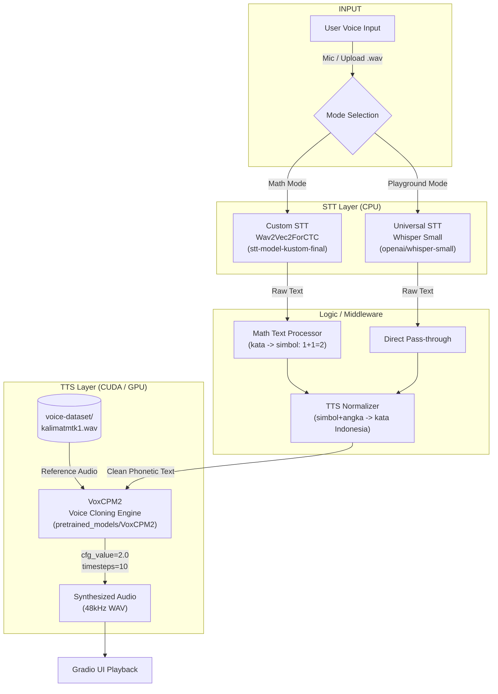
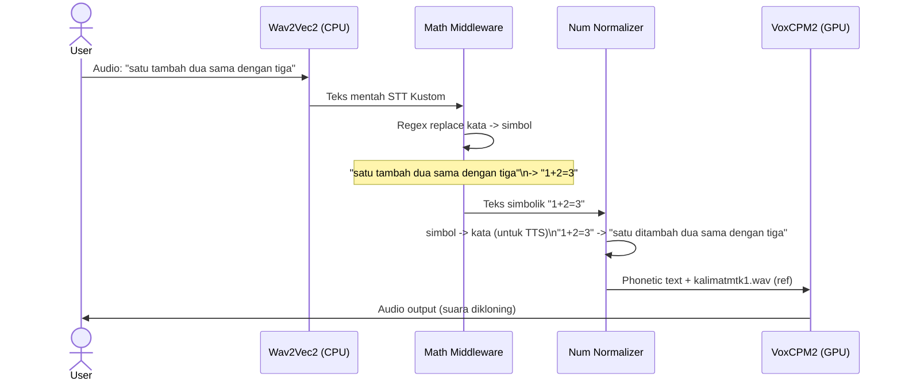
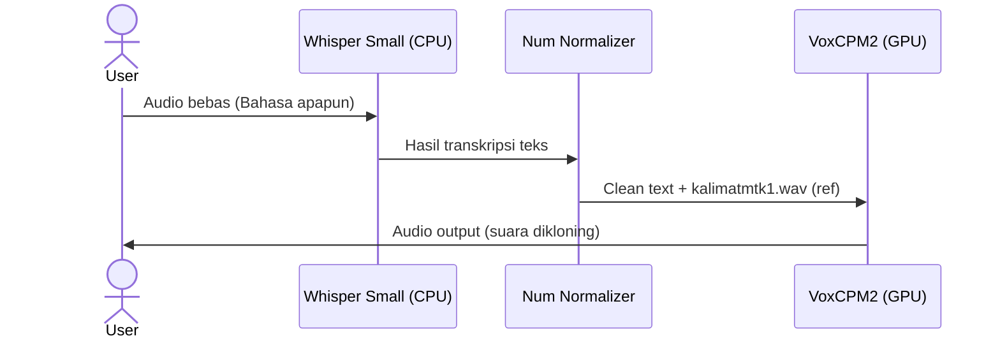
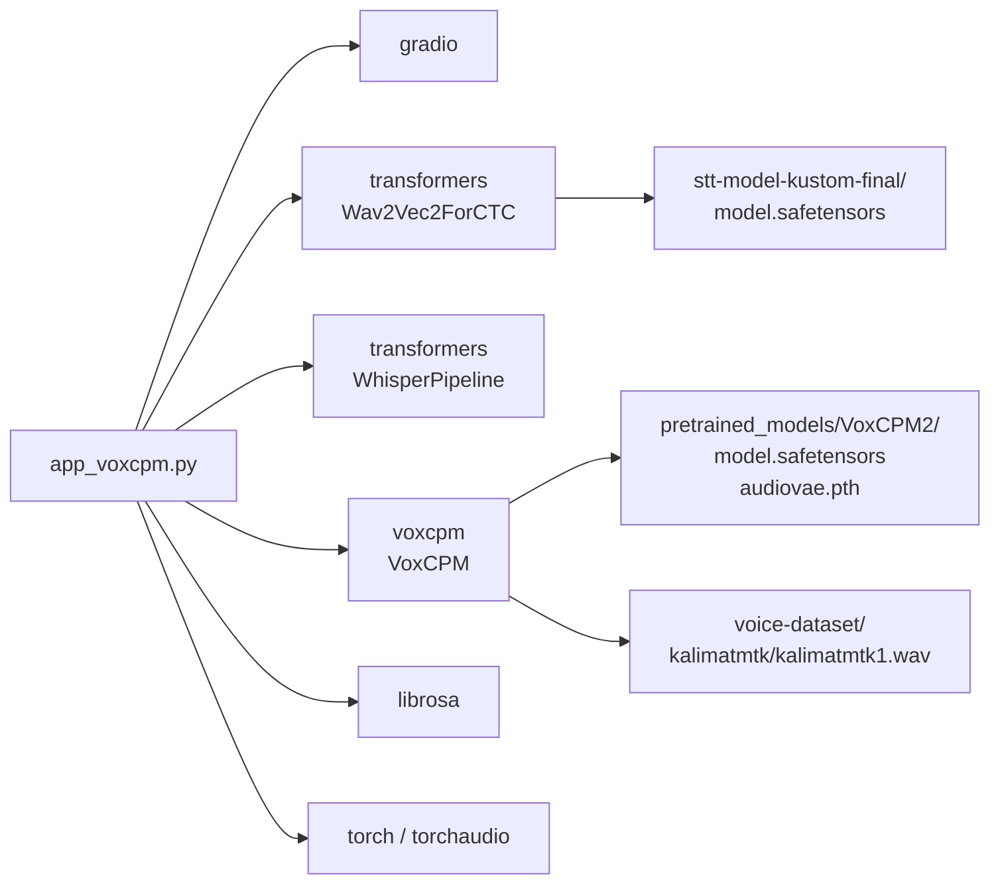

# UAS PTU - Sistem STT & TTS Terintegrasi dengan Voice Cloning

> **Proyek Ujian Akhir Semester - Pengantar Teknologi Informasi (PTU)**
> Lead Engineer: **Galitsar Gyasi Elfaris** — ITENAS Bandung

Sistem end-to-end **Speech-to-Text (STT)** dan **Text-to-Speech (TTS) dengan Voice Cloning** berbasis Gradio Web UI. Sistem mampu menerima input suara, mentranskripnya, memformat teks (terutama ekspresi matematika), lalu mensintesis ulang audio dengan suara yang dikloning dari dataset rekaman asli.

---

## Arsitektur Sistem



---

## Dua Mode Operasi

### Mode 1: Math Focus (Tab Utama / Tugas Akhir)

Pipeline khusus untuk transkripsi dan sintesis ekspresi matematika Bahasa Indonesia.



### Mode 2: Playground / Voice Cloning Bebas

Pipeline bebas untuk teks umum menggunakan Whisper sebagai STT universal.



---

## Struktur Direktori

```
UAS_PTU/
├── app_voxcpm.py              # Aplikasi utama (VoxCPM2 + Gradio) [AKTIF]
├── app.py                     # Versi lama (SpeechT5 + Whisper) [legacy]
├── test_voxcpm.py             # Script uji VoxCPM2 standalone
│
├── stt-model-kustom-final/    # Model STT fine-tuned (Wav2Vec2ForCTC)
│   ├── model.safetensors      # Bobot model
│   ├── config.json            # Konfigurasi arsitektur
│   ├── vocab.json             # Vocabulary (30 token)
│   └── preprocessor_config.json
│
├── pretrained_models/
│   └── VoxCPM2/               # Model TTS Voice Cloning
│       ├── model.safetensors  # Bobot utama (LM 2048-dim, 28 layer)
│       ├── audiovae.pth       # Audio VAE (encoder/decoder audio)
│       ├── config.json        # Konfigurasi arsitektur
│       └── tokenizer.json
│
└── voice-dataset/             # Dataset rekaman suara kustom
    ├── kalimatmtk/            # Kalimat matematika (dipakai sebagai REF_AUDIO)
    │   ├── kalimatmtk1.wav    # <-- referensi utama voice cloning
    │   ├── kalimatmtk2.wav
    │   ├── kalimatmtk3.wav
    │   └── kalimatmtk4.wav
    ├── kalimat/               # Kalimat umum
    │   ├── kalimat1.wav
    │   ├── kalimat2.wav
    │   ├── kalimat3.wav
    │   └── kalimat4.wav
    ├── angka/                 # Rekaman angka 1-9
    │   ├── angka1.wav
    │   └── ... (s/d angka9.wav)
    ├── fonetik/               # Rekaman fonetik
    │   └── ... (fonetik1-5.wav)
    └── huruf/                 # Rekaman huruf alfabet
        └── ... (34 file .wav)
```

---

## Model & Teknologi

| Komponen | Model | Device | Keterangan |
|---|---|---|---|
| STT Kustom | `Wav2Vec2ForCTC` | CPU | Fine-tuned pada dataset lokal, vocab 30 token, 24 hidden layer |
| STT Universal | `openai/whisper-small` | CPU | Multilingual, dipakai di Playground Mode |
| TTS + Voice Cloning | `VoxCPM2` | CUDA (GPU) | LM 2048-dim, 28 layer, Audio VAE 48kHz, CFM solver |
| UI Framework | `Gradio Blocks` | - | Versi web, port 7860 |

### Detail Arsitektur VoxCPM2

```
VoxCPM2
├── Language Model (Transformer)
│   ├── hidden_size     : 2048
│   ├── num_layers      : 28
│   ├── num_heads       : 16
│   ├── vocab_size      : 73,448
│   └── max_ctx_len     : 32,768
├── Audio Encoder (Transformer)
│   ├── hidden_dim      : 1024
│   ├── num_layers      : 12
│   └── num_heads       : 16
├── DiT / Flow Matching (CFM)
│   ├── hidden_dim      : 1024
│   ├── num_layers      : 12
│   ├── solver          : euler
│   └── cfg_rate        : 2.0
└── Audio VAE
    ├── sample_rate     : 16,000 Hz (input)
    └── out_sample_rate : 48,000 Hz (output)
```

---

## Cara Menjalankan

### Prasyarat

- Python 3.12+
- CUDA-compatible GPU (direkomendasikan >= 6GB VRAM, tested RTX 4060 8GB)
- Virtual environment sudah aktif

```bash
cd /home/ghalytsar/Kuliah/PTU/UAS_PTU
source .venv/bin/activate
```

### Install Dependensi

```bash
pip install gradio torch torchaudio librosa transformers speechbrain soundfile
pip install voxcpm
```

### Jalankan Aplikasi Utama

```bash
python app_voxcpm.py
```

Akses UI di browser: `http://localhost:7860`

### Uji VoxCPM2 Standalone

```bash
python test_voxcpm.py
# Output: voxcpm_test_math.wav, voxcpm_test_bebas.wav, voxcpm_test_ultimate.wav
```

---

## Mapping Kata-Simbol (Math Middleware)

Middleware mengonversi output STT ke format simbolik, lalu kembali ke kata untuk TTS:

| Input STT | -> Simbol | -> Input TTS |
|---|---|---|
| satu / dua / ... | 1 / 2 / ... | satu / dua / ... |
| tambah / ditambah | + | ditambah |
| kurang / dikurangi | - | dikurangi |
| kali / dikali | x | dikali |
| bagi / dibagi | : | dibagi |
| sama dengan / hasilnya | = | sama dengan |

---

## Dependency Graph



---

## Catatan Development & Pitfalls

Proses development melewati dua iterasi besar:

1.  **Iterasi 1 (app.py)**: Menggunakan SpeechT5 + HiFi-GAN + SpeechBrain speaker embedding. Ditemukan masalah: output hanya noise/robotic karena dataset terlalu kecil (48 sampel, 150 training steps). SpeechT5 juga tidak mengenali simbol matematika secara native.

2.  **Iterasi 2 (app_voxcpm.py)**: Migrasi ke VoxCPM2 yang bersifat zero-shot voice cloning (tidak perlu fine-tuning). Kualitas audio jauh lebih baik hanya dengan menyediakan 1 file referensi. STT Kustom (Wav2Vec2) tetap dipertahankan karena sudah di-fine-tune untuk domain matematika.

**Solusi teknis kunci:**
- STT (Wav2Vec2 + Whisper) dijalankan di CPU agar VRAM penuh tersedia untuk VoxCPM2
- Angka dan simbol matematik selalu dikonversi dua arah (kata -> simbol untuk display, simbol -> kata untuk TTS) karena model TTS tidak bisa mengucapkan karakter simbol secara langsung
- `kalimatmtk1.wav` dipilih sebagai referensi karena merupakan kalimat panjang yang mengandung banyak variasi fonetik

---

## File Output Tes

| File | Deskripsi |
|---|---|
| `voxcpm_test_math.wav` | Tes kalimat matematika via VoxCPM2 |
| `voxcpm_test_bebas.wav` | Tes kalimat bebas via VoxCPM2 |
| `voxcpm_test_ultimate.wav` | Tes dengan prompt_text (transcript-guided cloning) |
| `test_trimmed.wav` | Tes trim silence dari iterasi SpeechT5 |

---

## Referensi

- [VoxCPM2 (PyPI: voxcpm)](https://pypi.org/project/voxcpm/)
- [Wav2Vec2 - Hugging Face](https://huggingface.co/docs/transformers/model_doc/wav2vec2)
- [Whisper - OpenAI](https://github.com/openai/whisper)
- [Gradio Documentation](https://www.gradio.app/docs)
- [SpeechT5 - Microsoft (legacy)](https://huggingface.co/microsoft/speecht5_tts)
